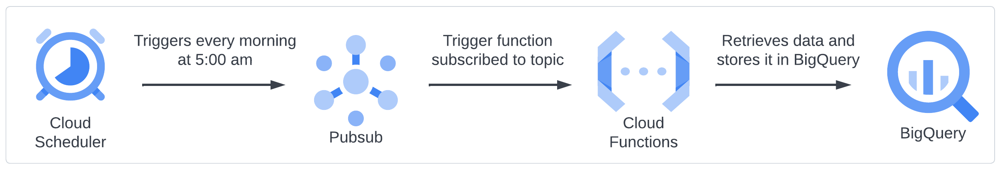

# :bar_chart: proj-power-rankings
## Overview
This project is the home of the Power Rankings project. At its core, it is a Python script that retrieves NHL scores from the night before and writes them to a BigQuery table. From there, linear regression is used to calculate power ratings of each time based on their season performance. Finally, each team is then ranked.

## High-Level Architecture

### Cloud Scheduler
[Cloud Scheduler](https://cloud.google.com/scheduler/docs/overview) executes units of work based on a defined schedule. In this use case, Cloud Scheduler is sent to trigger a Pub/Sub topic every morning at 5:00 AM EST.

### Pub/Sub
[Pub/Sub](https://cloud.google.com/pubsub/docs/overview) is used for streaming analytics and data pipeline to ingest and distribute data. In this use case, Pub/Sub is used to trigger the Cloud Function when an event is received from the Cloud Scheduler.

### Cloud Functions
[Cloud Functions](https://cloud.google.com/functions/docs/concepts/overview) is a serverless execution environment that allows you to write simple, single-purposed functions that are attached to events. In this use case, the Cloud Function is subscribed to a Pub/Sub topic is runs every time that topic is triggered.

### BigQuery
[BigQuery](https://cloud.google.com/bigquery/docs/introduction) is a managed enterprise data warehouse that helps manage and analyze data with built-in features such as machine learning. In this use case, BigQuery is used to store the data from the Cloud Function and to run machine learning algorithms on that data.